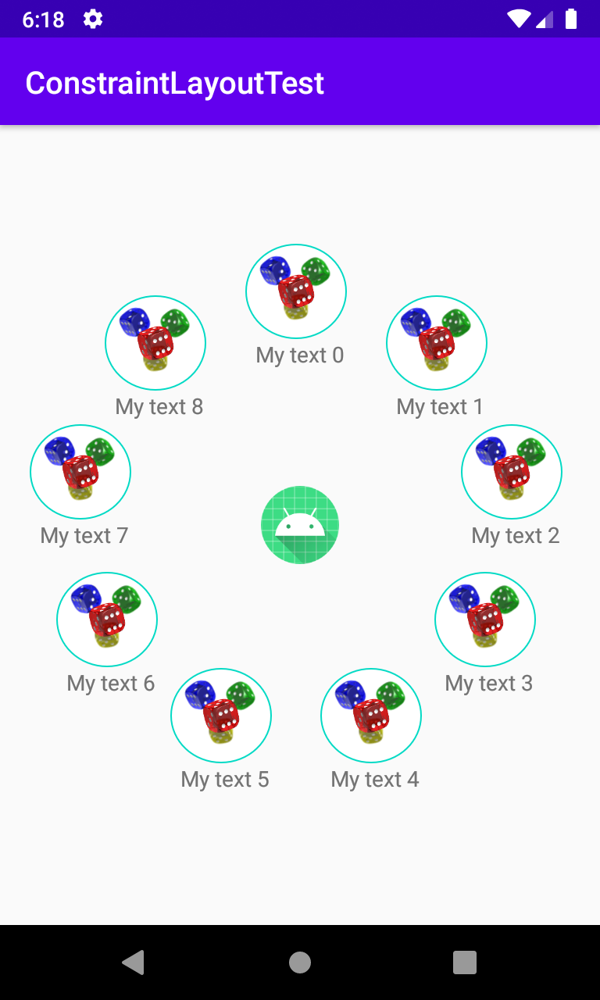

# Circular-layout
A sample app to show usage of circular attribute in ConstraintLayout. Present a data in form of circle.

# Sample result

# Credit
Thanks to (https://github.com/kpchandora)
Original source code (https://github.com/kpchandora/circular-constraint-layout)
Sample image credit goes to (https://developers.google.com/speed/webp/gallery2)
